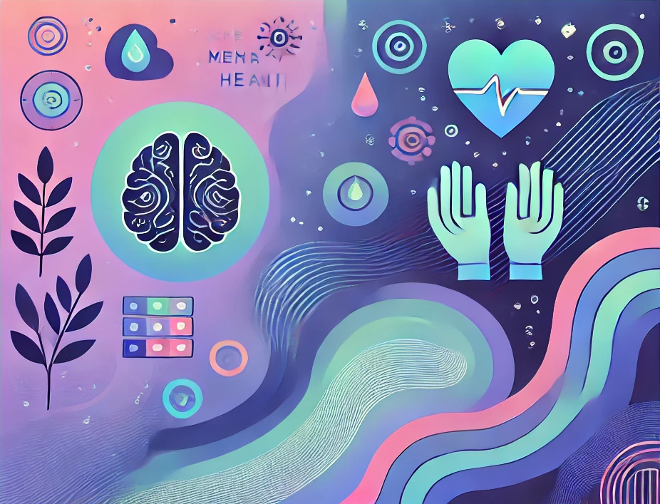
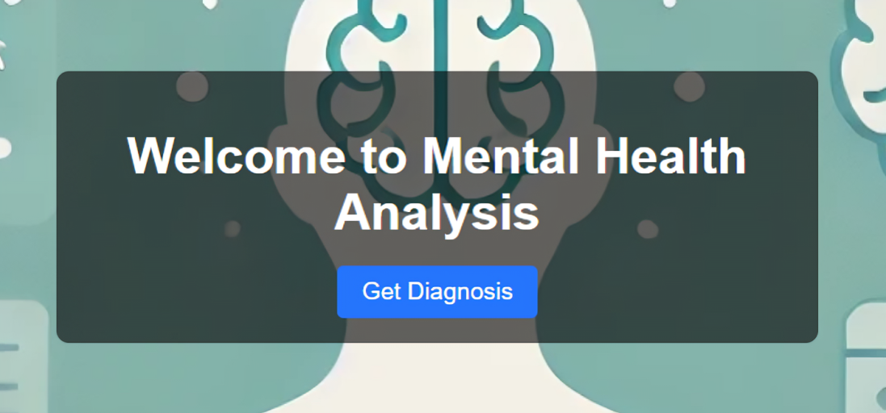
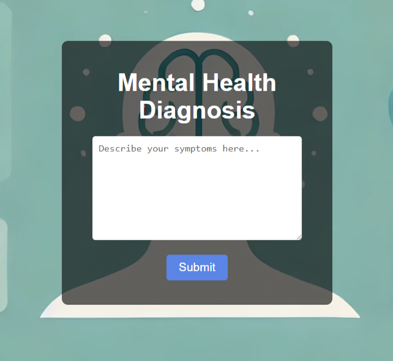
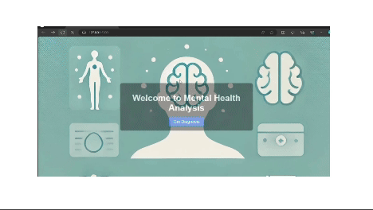
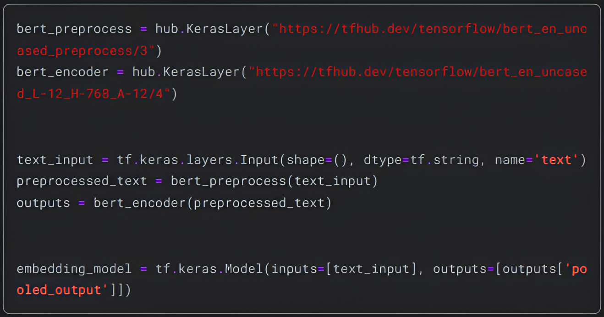
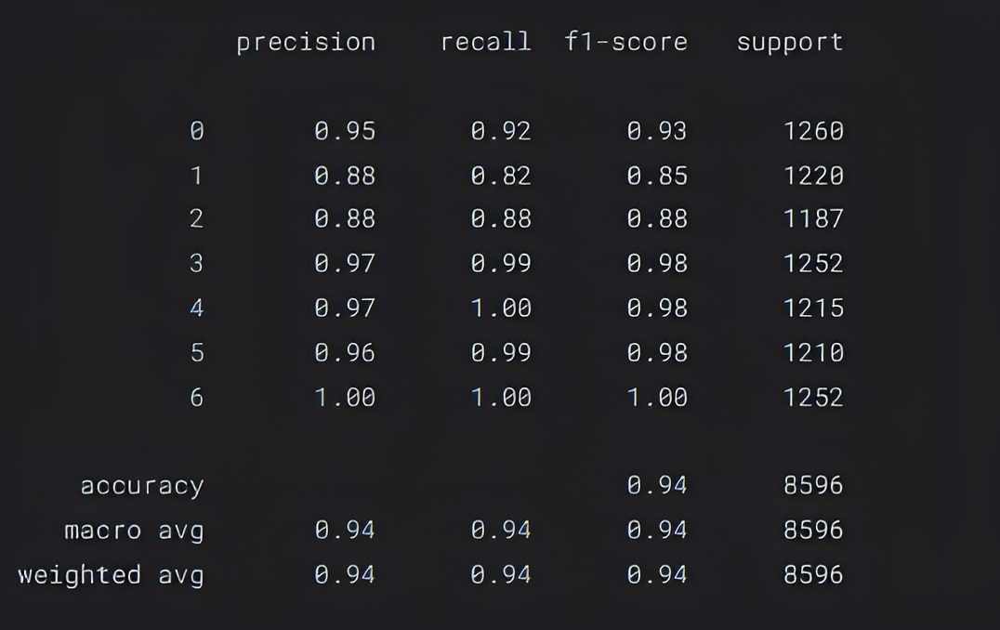
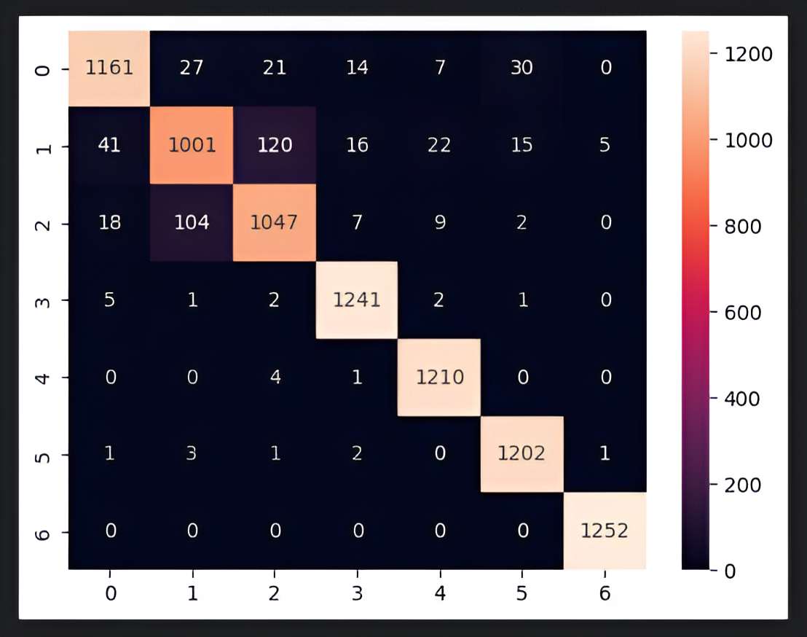

# Mental Health Analysis



## Overview
<a name="overview"></a>

This project aims to analyze and classify mental health statuses using Natural Language Processing (NLP) techniques and machine learning models. The final deliverable is a web application that predicts mental health conditions based on user inputs.

## Table of Contents
- [Overview](#overview)
- [Project Structure](#project-structure)
- [Dataset](#dataset)
- [Installation](#installation)
  - [Project Setup](#project-setup)
- [Application Description](#application-description)
  - [Web Application](#web-application)
  - [User Interface](#user-interface)
- [Chatbot Description](#chatbot-description)
- [Model Description](#model-description)
  - [Model Training](#model-training)
  - [Model Artifacts](#model-artifacts)
- [Results](#results)
- [Conclusion](#conclusion)
- [Acknowledgments](#acknowledgments)
- [Contributions](#contributions)

## Project Structure
<a name="project-structure"></a>
```plaintext
mental_health_analysis/
│
├── .gitignore
├── README.md
├── requirements.txt
├── setup.py
│
├── application/
│   ├── server.py
│   ├── utils.py
│   ├── chatbot.py
│   ├── __init__.py
│   ├── artifacts/
│   │   └── model_mha.pkl
│   ├── static/
│   │   ├── home.css
│   │   ├── index.css
│   │   ├── assistant.css
│   │   └── images/
│   │       └── background3.png
│   └── templates/
│       ├── home.html
│       ├── index.html
│       └── assistant.html
│
├── assets/
│   ├── classification_report.png
│   ├── confusion_matrix.png
│   ├── embedding_model.png
│   ├── home.png
│   ├── index.png
│   ├── assistant.png
│   └── demo.gif
│   └── chatbot.gif
│
└── model/
    ├── mental-health-eda-modelling-bert-94-accuracy.ipynb
    └── dataset/
        └── Combined Data.csv
```
## Dataset
<a name="dataset"></a>
The dataset used for training and evaluating the model is sourced from https://www.kaggle.com/datasets/suchintikasarkar/sentiment-analysis-for-mental-health. It contains text labeled with various mental health conditions.

## Installation
<a name="installation"></a>
### Project Setup
<a name="project-setup"></a>
After cloning the repository, navigate to the project directory and set up the project. Ensure you have Python 3.10.13 installed. Create and activate a virtual environment, then install the required dependencies:

```bash
git clone <https://github.com/yc1909/Mental_Health_Analysis.git>
cd mental_health_analysis
conda create -p venv python==3.10.13 -y
pip install -r requirements.txt
```
## Application Description
<a name="application-description"></a>

### Web Application
<a name="web-application"></a>
The web application is built using Flask and provides an interface for users to input text and receive predictions on mental health conditions. The application structure is organized as follows:

**Templates**: HTML files for the frontend `home.html`, `index.html`, `assistant.html`.

**Static**: Contains CSS files `home.css`, `index.css`, `assistant.css`  and images `background3.png`.

### User Interface
<a name="user-interface"></a>
The interface is designed to be intuitive and user-friendly. 

 

Below is a demo:



## Chatbot Description
<a name="chatbot-description"></a>

The new chatbot feature acts as a helpful assistant to answer queries related to mental health. The chatbot is implemented using FastAPI, and it leverages Langchain and Ollama models to generate responses. The interaction is managed through the following files:

**assistant.html**: The HTML template for the chatbot interface.
**assistant.css**: The CSS file for styling the chatbot interface.
**chatbot.py**: The FastAPI server code that handles chatbot interactions.

The chatbot listens for user input through the /chat endpoint and provides responses using a predefined prompt and the Ollama language model. The responses are parsed using the StrOutputParser, ensuring clear and relevant answers. Below is a demo of the chatbot in action:

## Model Description
<a name="model-description"></a>

### Model Training
<a name="model-training"></a>
The model was trained using BERT, a state-of-the-art NLP model. The training process is documented in the Jupyter notebook `mental-health-eda-modelling-bert-94-accuracy.ipynb`. Given the size of the embedding model, it's recommended to run the notebook to generate embeddings. Below is an example of the code used for embedding:



### Model Artifacts
<a name="model-artifacts"></a>
The trained model is saved in the `artifacts` folder as `model_mha.pkl`. This model can be loaded to make predictions on new data.

## Results
<a name="results"></a>
The model achieved 94% accuracy on the validation set. Below are the visualizations of the classification report and confusion matrix:

**Classification Report:**



**Confusion Matrix:**
These figures demonstrate the model’s performance across various metrics like precision, recall, and F1-score.



## Conclusion
<a name="conclusion"></a>
This project successfully leverages NLP and machine learning to predict mental health conditions from textual data. The web application provides a practical interface for users to engage with the model and obtain predictions.

## Acknowledgments
<a name="acknowledgments"></a>
1. Dataset provided by `Kaggle`.
2. BERT model from `TensorFlow Hub`.

## Contributions
<a name="contributions"></a>

Contributions are welcome! Here's how you can help:

1. Fork the repository on GitHub.
2. Clone your fork to your local machine.
3. Create a new branch for your feature or bug fix.
4. Make your changes and commit them with descriptive messages.
5. Push to your fork and submit a pull request.
6. Ensure your changes pass existing tests and add new tests if necessary.
